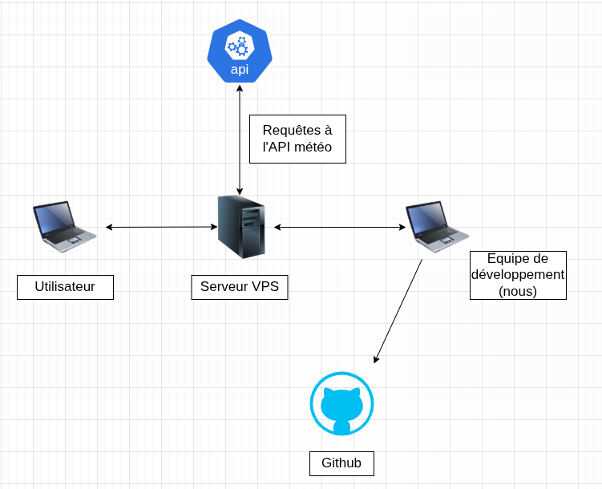
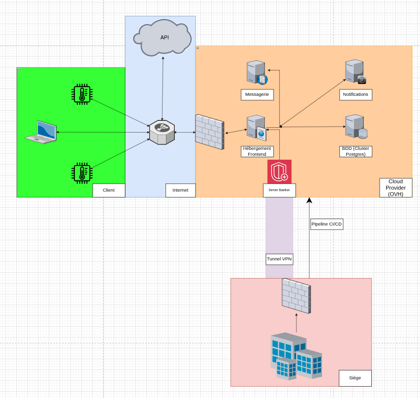

# 🏗️ Architecture Technique : Du MVP à la Vision Cible

Dans le cadre de ce projet, nous avons adopté une démarche en deux temps. D'abord, la conception d'une architecture pragmatique pour notre Minimum Viable Product (MVP) répondant aux contraintes du hackathon[cite: 1]. Ensuite, la modélisation d'une architecture cible démontrant comment cette solution évoluerait dans un contexte de production à grande échelle pour des acteurs agricoles[cite: 1].

---

## 1. L'Architecture MVP (Le Prototype Actuel)

Ce premier schéma illustre l'infrastructure que nous avons réellement mise en place et déployée durant ces trois jours et demi de développement. L'objectif principal était de garantir un déploiement fonctionnel, rapide et centralisé[cite: 1].

*   **Le Serveur Central (Serveur VPS) :** C'est le cœur de notre prototype. Il héberge à la fois notre application (Frontend et Backend) et notre base de données. Ce choix d'infrastructure "tout-en-un" est idéal pour un MVP car il réduit la complexité réseau et accélère les itérations.
*   **Les Utilisateurs :** Ils se connectent directement au serveur VPS via leur navigateur pour accéder au tableau de bord et aux alertes[cite: 1].
*   **L'Enrichissement des Données (API Météo) :** Notre serveur VPS communique avec une API météorologique externe pour récupérer les conditions climatiques, indispensables au déclenchement de nos règles métier et alertes[cite: 1].
*   **L'Équipe de Développement & GitHub :** L'équipe code sur ses machines locales (les ordinateurs à droite), versionne le code sur un dépôt GitHub centralisé, et interagit avec le VPS pour les mises en production manuelles.

---

## 2. L'Architecture Cible (La Vision d'Entreprise)

Ce second schéma représente l'évolution idéale de notre infrastructure si le projet devait être déployé commercialement auprès de centaines d'exploitations agricoles. Il répond aux enjeux de haute disponibilité, de sécurité renforcée et d'automatisation.

### A. Zone Client & Réseau Public (Vert & Bleu)
*   **Intégration IoT (Capteurs) :** Contrairement au MVP, la collecte de données est ici automatisée grâce à des capteurs connectés (température, humidité) placés directement dans les parcelles[cite: 1].
*   **Routage Intelligent :** Un Load Balancer (Répartiteur) gère le trafic entrant (utilisateurs, capteurs, API externes) pour le distribuer efficacement vers nos serveurs sans risquer la surcharge.

### B. Zone Cloud Provider - Hébergement (Orange)
*   **Séparation des couches :** Le serveur "tout-en-un" du MVP est découpé. Le Frontend et la logique métier ont leur propre espace sécurisé derrière un pare-feu.
*   **Stockage et Services Dédiés :** La base de données devient un composant isolé et robuste (Cluster Postgres). Des serveurs dédiés à la messagerie et aux notifications sont ajoutés pour gérer l'envoi massif d'alertes aux agriculteurs[cite: 1].

### C. Zone d'Administration & Déploiement (Rouge/Violet)
*   **Sécurité des accès (Bastion & VPN) :** Les administrateurs réseau (au Siège) accèdent désormais à l'infrastructure cloud via un tunnel VPN chiffré connecté à un serveur Bastion, rendant l'administration invisible et inaccessible depuis Internet.
*   **Industrialisation (CI/CD) :** Les déploiements manuels du MVP sont remplacés par un pipeline CI/CD (Intégration et Déploiement Continus). Chaque mise à jour du code est testée et déployée automatiquement sur les serveurs, réduisant le risque d'erreur humaine.